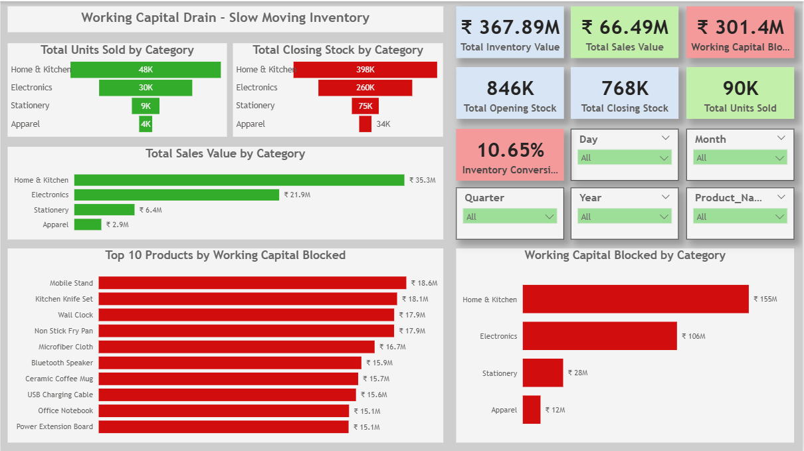

# 📊 Working Capital Drain Analysis - Slow Moving Inventory

## 📌 Project Overview
This Power BI dashboard analyzes slow-moving inventory and shows how much working capital is blocked in unsold products. The dashboard helps businesses identify products and categories with high inventory and low sales.

## 🎯 Project Objective
The main goals of this project are:
- Find slow-moving inventory.
- Measure blocked working capital.
- Compare sales and stock levels.
- Identify categories with excess inventory.
- Help improve inventory management.

## 🛠 Tool Used
- Power BI

## 📊 Dashboard Metrics
- Total Inventory Value
- Total Sales Value
- Working Capital Blocked
- Opening Stock
- Closing Stock
- Total Units Sold
- Inventory Conversion Rate

## 📈 Key Insights

### 1. High Working Capital Blocked
- Total Inventory Value: ₹367.89M
- Total Sales Value: ₹66.49M
- Working Capital Blocked: ₹301.4M

A large amount of money is stuck in unsold inventory.

### 2. Home & Kitchen Category Has the Highest Stock
- Units Sold: 48K
- Closing Stock: 398K
- Working Capital Blocked: ₹155M

This category has the highest sales but also the highest unsold inventory.

### 3. Electronics Category Has High Inventory
- Units Sold: 30K
- Closing Stock: 260K
- Working Capital Blocked: ₹106M

A large amount of inventory is still available in this category.

### 4. Low Inventory Conversion Rate
- Inventory Conversion Rate: 10.65%

This shows that only a small part of inventory is converted into sales.

### 5. Products Blocking the Most Working Capital
- Mobile Stand
- Kitchen Knife Set
- Wall Clock
- Non-Stick Fry Pan
- Microfiber Cloth
- Bluetooth Speaker
- Ceramic Coffee Mug
- USB Charging Cable
- Office Notebook
- Power Extension Board

## 💡 Recommendations
- Offer discounts on slow-moving products.
- Reduce excess inventory.
- Improve inventory planning.
- Focus on categories with high blocked capital.
- Monitor inventory regularly.

## 📊 Dashboard Preview

## 🚀 Conclusion
This dashboard shows that a large amount of working capital is blocked in slow-moving inventory. Home & Kitchen and Electronics are the main categories causing this issue. Better inventory management can help reduce blocked capital and improve business performance.

---
## 👨‍💻 Created By
**Deepanshu Kawale**

## 📚 Project Type
Power BI Dashboard

## 🔗 Skills Used
- Power BI
- Data Visualization
- Inventory Analysis
- KPI Tracking
- Business Insights
